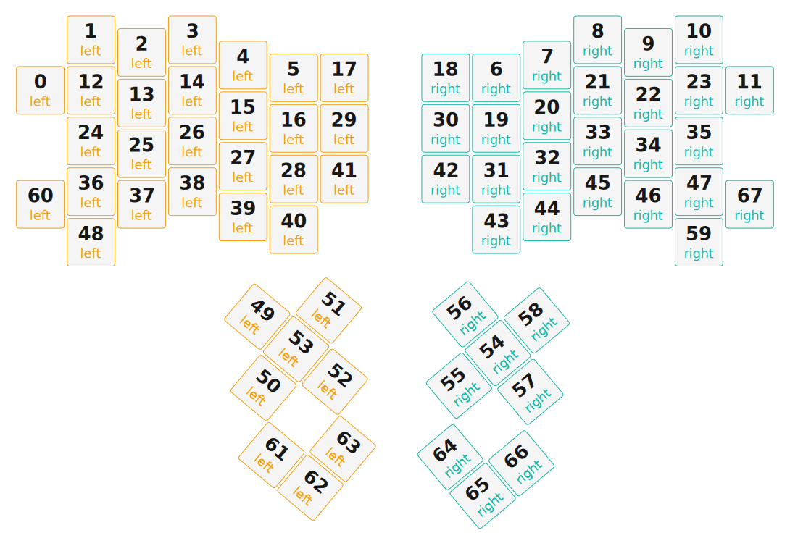

# ZMK Configuration for Nirvana

*Generated by Shield Wizard for ZMK*



Download compiled firmware from the Actions tab. <https://zmk.dev/docs/user-setup#installing-the-firmware>

Edit your keymap <https://zmk.dev/docs/keymaps>.
User keymap is located at [`config/nirvana.keymap`](config/nirvana.keymap).

-----

<details>
<summary>
Shield Wizard Debug Information
</summary>

In case of broken configuration, here is the Shield Wizard internal data used to generate this configuration:

Commit: 5840d41ac0915092c8fe45da617ffb4bb91e1b97

```json
{"name":"Nirvana","shield":"nirvana","dongle":true,"modules":["petejohanson/cirque"],"layout":[{"id":"01KKV3V1K0BB74G2V9HXRPD4CJ","part":0,"row":0,"col":0,"w":1,"h":1,"x":0,"y":1,"r":0,"rx":0,"ry":0},{"id":"01KKV3VEGGES3JZYGDJGTGTAKQ","part":0,"row":0,"col":1,"w":1,"h":1,"x":1,"y":0,"r":0,"rx":0,"ry":0},{"id":"01KKV41EVRMC89B7QH985TBZ0E","part":0,"row":0,"col":2,"w":1,"h":1,"x":2,"y":0.25,"r":0,"rx":0,"ry":0},{"id":"01KKV41F8TVD373NJMJ532RVNE","part":0,"row":0,"col":3,"w":1,"h":1,"x":3,"y":0,"r":0,"rx":0,"ry":0},{"id":"01KKV41FMGE763CWHRYZY1S2HN","part":0,"row":0,"col":4,"w":1,"h":1,"x":4,"y":0.5,"r":0,"rx":0,"ry":0},{"id":"01KKV41HTRGG6PDQXA8GH7SKHD","part":0,"row":0,"col":5,"w":1,"h":1,"x":5,"y":0.75,"r":0,"rx":0,"ry":0},{"id":"01KKV41PHZ3DNA3NRCQYYV89GP","part":1,"row":0,"col":7,"w":1,"h":1,"x":9,"y":0.75,"r":0,"rx":0,"ry":0},{"id":"01KKV42H88CWYBYW0VJ6EHBPJD","part":1,"row":0,"col":8,"w":1,"h":1,"x":10,"y":0.5,"r":0,"rx":0,"ry":0},{"id":"01KKV42HCRAQRNXK6MH27MFPKX","part":1,"row":0,"col":9,"w":1,"h":1,"x":11,"y":0,"r":0,"rx":0,"ry":0},{"id":"01KKV42HGRDVPC06PE0S1KCX3N","part":1,"row":0,"col":10,"w":1,"h":1,"x":12,"y":0.25,"r":0,"rx":0,"ry":0},{"id":"01KKV42HN045JR0C23K0ESM4DD","part":1,"row":0,"col":11,"w":1,"h":1,"x":13,"y":0,"r":0,"rx":0,"ry":0},{"id":"01KKV42J60TYFJWGPBAGDC8T4P","part":1,"row":0,"col":12,"w":1,"h":1,"x":14,"y":1,"r":0,"rx":0,"ry":0},{"id":"01KKV42TSQRK0WCPDBVW9G4H0N","part":0,"row":1,"col":0,"w":1,"h":1,"x":1,"y":1,"r":0,"rx":0,"ry":0},{"id":"01KKV433G996CZVTPZFHD3RQ69","part":0,"row":1,"col":1,"w":1,"h":1,"x":2,"y":1.25,"r":0,"rx":0,"ry":0},{"id":"01KKV433M8J2HV3NVQHCJAZZ0N","part":0,"row":1,"col":2,"w":1,"h":1,"x":3,"y":1,"r":0,"rx":0,"ry":0},{"id":"01KKV433ZRRG3CDNSG8SYARTV3","part":0,"row":1,"col":3,"w":1,"h":1,"x":4,"y":1.5,"r":0,"rx":0,"ry":0},{"id":"01KKV4344FW7FN6D45FBVCZ6S1","part":0,"row":1,"col":4,"w":1,"h":1,"x":5,"y":1.75,"r":0,"rx":0,"ry":0},{"id":"01KKV4348W1MQJZ7KN56TMY9G2","part":0,"row":1,"col":5,"w":1,"h":1,"x":6,"y":0.75,"r":0,"rx":0,"ry":0},{"id":"01KKV434J018BC8Z5GBRS6HVKG","part":1,"row":1,"col":7,"w":1,"h":1,"x":8,"y":0.75,"r":0,"rx":0,"ry":0},{"id":"01KKV43QK1602K97ZZKPDNKF9W","part":1,"row":1,"col":8,"w":1,"h":1,"x":9,"y":1.75,"r":0,"rx":0,"ry":0},{"id":"01KKV43QQ15HJ47PJX9WJC31A1","part":1,"row":1,"col":9,"w":1,"h":1,"x":10,"y":1.5,"r":0,"rx":0,"ry":0},{"id":"01KKV43QTR8NDBKR7W5R7B1M1W","part":1,"row":1,"col":10,"w":1,"h":1,"x":11,"y":1,"r":0,"rx":0,"ry":0},{"id":"01KKV43QYGBF2VWERY8B4KZ07E","part":1,"row":1,"col":11,"w":1,"h":1,"x":12,"y":1.25,"r":0,"rx":0,"ry":0},{"id":"01KKV43R3A471N2ZF6W839NK48","part":1,"row":1,"col":12,"w":1,"h":1,"x":13,"y":1,"r":0,"rx":0,"ry":0},{"id":"01KKVBAH9DQKKS4CJJ94JDP8JT","part":0,"row":2,"col":0,"w":1,"h":1,"x":1,"y":2,"r":0,"rx":0,"ry":0},{"id":"01KKVA8STYX6F6VVNAPZVN6FCP","part":0,"row":2,"col":1,"w":1,"h":1,"x":2,"y":2.25,"r":0,"rx":0,"ry":0},{"id":"01KKVBASY8C4FT6F5A5Q9BM48F","part":0,"row":2,"col":2,"w":1,"h":1,"x":3,"y":2,"r":0,"rx":0,"ry":0},{"id":"01KKVBAT361C4TFX88185PWVY0","part":0,"row":2,"col":3,"w":1,"h":1,"x":4,"y":2.5,"r":0,"rx":0,"ry":0},{"id":"01KKVBAT8535DAXB3YK7A7B3PN","part":0,"row":2,"col":4,"w":1,"h":1,"x":5,"y":2.75,"r":0,"rx":0,"ry":0},{"id":"01KKVBB7D8CE59RHTEWH8WNB4R","part":0,"row":2,"col":5,"w":1,"h":1,"x":6,"y":1.75,"r":0,"rx":0,"ry":0},{"id":"01KKVBBGNP8R2583FH1CZV6ZD8","part":1,"row":2,"col":7,"w":1,"h":1,"x":8,"y":1.75,"r":0,"rx":0,"ry":0},{"id":"01KKVBBGVD0SXRG6XJ7ACBM294","part":1,"row":2,"col":8,"w":1,"h":1,"x":9,"y":2.75,"r":0,"rx":0,"ry":0},{"id":"01KKVBBH85M4KBTVVXH09C8QJW","part":1,"row":2,"col":9,"w":1,"h":1,"x":10,"y":2.5,"r":0,"rx":0,"ry":0},{"id":"01KKVBBHW61MJSC52BH6Y1B9XS","part":1,"row":2,"col":10,"w":1,"h":1,"x":11,"y":2,"r":0,"rx":0,"ry":0},{"id":"01KKVBBJ1PCGW9J2S3ZSFE58S5","part":1,"row":2,"col":11,"w":1,"h":1,"x":12,"y":2.25,"r":0,"rx":0,"ry":0},{"id":"01KKVBBJ7D0AZZ11SR2C63MF2M","part":1,"row":2,"col":12,"w":1,"h":1,"x":13,"y":2,"r":0,"rx":0,"ry":0},{"id":"01KKVBC336T42H8FDQRGRX703Z","part":0,"row":3,"col":0,"w":1,"h":1,"x":1,"y":3,"r":0,"rx":0,"ry":0},{"id":"01KKVBC37YYY0Q3KP56089JR76","part":0,"row":3,"col":1,"w":1,"h":1,"x":2,"y":3.25,"r":0,"rx":0,"ry":0},{"id":"01KKVBC3CNX0VMKCWHAA4R6Y7E","part":0,"row":3,"col":2,"w":1,"h":1,"x":3,"y":3,"r":0,"rx":0,"ry":0},{"id":"01KKVBC3HQRZSSN077P64E5KC5","part":0,"row":3,"col":3,"w":1,"h":1,"x":4,"y":3.5,"r":0,"rx":0,"ry":0},{"id":"01KKVBC3PNBCMCAQXZCH1E3YMP","part":0,"row":3,"col":4,"w":1,"h":1,"x":5,"y":3.75,"r":0,"rx":0,"ry":0},{"id":"01KKVBC3VP6FCC5BP8TBWEM550","part":0,"row":3,"col":5,"w":1,"h":1,"x":6,"y":2.75,"r":0,"rx":0,"ry":0},{"id":"01KKVBCC9EW8671D2E84VBQPSE","part":1,"row":3,"col":7,"w":1,"h":1,"x":8,"y":2.75,"r":0,"rx":0,"ry":0},{"id":"01KKVBCCDZKJDCMQ5EW0R35981","part":1,"row":3,"col":8,"w":1,"h":1,"x":9,"y":3.75,"r":0,"rx":0,"ry":0},{"id":"01KKVBCCJX9BBZPJYGQV66W97R","part":1,"row":3,"col":9,"w":1,"h":1,"x":10,"y":3.5,"r":0,"rx":0,"ry":0},{"id":"01KKVBCCR06YGRYX0XP66BQ6PF","part":1,"row":3,"col":10,"w":1,"h":1,"x":11,"y":3,"r":0,"rx":0,"ry":0},{"id":"01KKVBCCWS81DCSAYHAGGPGDC8","part":1,"row":3,"col":11,"w":1,"h":1,"x":12,"y":3.25,"r":0,"rx":0,"ry":0},{"id":"01KKVBCD16YPK5GKVND7DXE197","part":1,"row":3,"col":12,"w":1,"h":1,"x":13,"y":3,"r":0,"rx":0,"ry":0},{"id":"01KKV43TWRVS3MYPBM2T7WSCKS","part":0,"row":4,"col":0,"w":1,"h":1,"x":1,"y":4,"r":0,"rx":0,"ry":0},{"id":"01KKV442TQ54EWYPS72EP02H0V","part":0,"row":4,"col":1,"w":1,"h":1,"x":7,"y":1,"r":40,"rx":0,"ry":0},{"id":"01KKV442ZWED8HT7DWSYHBSPKP","part":0,"row":4,"col":2,"w":1,"h":1,"x":8,"y":2,"r":40,"rx":0,"ry":0},{"id":"01KKV4434SCSFW14AXP1Q5V8JS","part":0,"row":4,"col":3,"w":1,"h":1,"x":8,"y":0,"r":40,"rx":0,"ry":0},{"id":"01KKV4439GZ6KMJ0E2CVN9WQ1V","part":0,"row":4,"col":4,"w":1,"h":1,"x":9,"y":1,"r":40,"rx":0,"ry":0},{"id":"01KKV443F0G2P1V26GW8SV2EV4","part":0,"row":4,"col":5,"w":1,"h":1,"x":8,"y":1,"r":40,"rx":0,"ry":0},{"id":"01KKVBCVW6E7C18X5V61RZJNTR","part":1,"row":4,"col":7,"w":1,"h":1,"x":2.5,"y":10.75,"r":-40,"rx":0,"ry":0},{"id":"01KKVBCW0PEDF0P63YJ2FZB315","part":1,"row":4,"col":8,"w":1,"h":1,"x":1.5,"y":10.75,"r":-40,"rx":0,"ry":0},{"id":"01KKVBCW5E6G0Z7STJBRQVGSTD","part":1,"row":4,"col":9,"w":1,"h":1,"x":2.5,"y":9.75,"r":-40,"rx":0,"ry":0},{"id":"01KKVBCWAM9BGZBW97B8TT2XCP","part":1,"row":4,"col":10,"w":1,"h":1,"x":2.5,"y":11.75,"r":-40,"rx":0,"ry":0},{"id":"01KKVBCWFDHGGWH6893HTYPNSF","part":1,"row":4,"col":11,"w":1,"h":1,"x":3.5,"y":10.75,"r":-40,"rx":0,"ry":0},{"id":"01KKVBCWM7BSK9S138NZ898GT7","part":1,"row":4,"col":12,"w":1,"h":1,"x":13,"y":4,"r":0,"rx":0,"ry":0},{"id":"01KKV44680GTHMACKW5M3K85ME","part":0,"row":5,"col":0,"w":1,"h":1,"x":0,"y":3.25,"r":0,"rx":0,"ry":0},{"id":"01KKVA8SG88W0MRYN352V55X2G","part":0,"row":5,"col":1,"w":1,"h":1,"x":5,"y":8,"r":40,"rx":5,"ry":8},{"id":"01KKVA8SN7B5NEZK3031NJAZQQ","part":0,"row":5,"col":2,"w":1,"h":1,"x":6,"y":8,"r":40,"rx":5,"ry":8},{"id":"01KKVBD6J0JHQBTQC7M81H19KB","part":0,"row":5,"col":3,"w":1,"h":1,"x":6,"y":7,"r":40,"rx":5,"ry":8},{"id":"01KKVBD6P65NDFGGCBNDBFJNC1","part":1,"row":5,"col":9,"w":1,"h":1,"x":8,"y":5,"r":-40,"rx":13,"ry":7},{"id":"01KKVBD6V5H4R7TY0J7C8GDK6E","part":1,"row":5,"col":10,"w":1,"h":1,"x":8,"y":6,"r":-40,"rx":13,"ry":7},{"id":"01KKVBTEBZ8NM1HF0WRHZXH1ME","part":1,"row":5,"col":11,"w":1,"h":1,"x":9,"y":6,"r":-40,"rx":13,"ry":7},{"id":"01KKVBTEFT3Y2ZET96JPM4X4RV","part":1,"row":5,"col":12,"w":1,"h":1,"x":14,"y":3.25,"r":0,"rx":0,"ry":0}],"parts":[{"name":"left","controller":"nice_nano_v2","wiring":"matrix_diode","pins":{"d1":"encoder","d0":"encoder","d2":"encoder","d3":"encoder","d4":"output","d5":"output","d6":"output","d7":"output","d8":"output","d9":"output","d19":"input","d18":"input","d15":"input","d14":"input","d16":"input","d10":"input"},"keys":{"01KKV3V1K0BB74G2V9HXRPD4CJ":{"input":"d19","output":"d4"},"01KKV3VEGGES3JZYGDJGTGTAKQ":{"input":"d19","output":"d5"},"01KKV41EVRMC89B7QH985TBZ0E":{"input":"d19","output":"d6"},"01KKV41F8TVD373NJMJ532RVNE":{"input":"d19","output":"d7"},"01KKV41FMGE763CWHRYZY1S2HN":{"input":"d19","output":"d8"},"01KKV41HTRGG6PDQXA8GH7SKHD":{"input":"d19","output":"d9"},"01KKV42TSQRK0WCPDBVW9G4H0N":{"input":"d18","output":"d4"},"01KKV433G996CZVTPZFHD3RQ69":{"input":"d18","output":"d5"},"01KKV433M8J2HV3NVQHCJAZZ0N":{"input":"d18","output":"d6"},"01KKV433ZRRG3CDNSG8SYARTV3":{"input":"d18","output":"d7"},"01KKV4344FW7FN6D45FBVCZ6S1":{"input":"d18","output":"d8"},"01KKV4348W1MQJZ7KN56TMY9G2":{"input":"d18","output":"d9"},"01KKVBAH9DQKKS4CJJ94JDP8JT":{"input":"d15","output":"d4"},"01KKVBC336T42H8FDQRGRX703Z":{"input":"d14","output":"d4"},"01KKV43TWRVS3MYPBM2T7WSCKS":{"input":"d16","output":"d4"},"01KKV44680GTHMACKW5M3K85ME":{"input":"d10","output":"d4"},"01KKVA8STYX6F6VVNAPZVN6FCP":{"input":"d15","output":"d5"},"01KKVBC37YYY0Q3KP56089JR76":{"input":"d14","output":"d5"},"01KKV442TQ54EWYPS72EP02H0V":{"input":"d16","output":"d5"},"01KKVA8SG88W0MRYN352V55X2G":{"input":"d10","output":"d5"},"01KKVBASY8C4FT6F5A5Q9BM48F":{"input":"d15","output":"d6"},"01KKVBC3CNX0VMKCWHAA4R6Y7E":{"input":"d14","output":"d6"},"01KKV442ZWED8HT7DWSYHBSPKP":{"input":"d16","output":"d6"},"01KKVA8SN7B5NEZK3031NJAZQQ":{"input":"d10","output":"d6"},"01KKVBAT361C4TFX88185PWVY0":{"input":"d15","output":"d7"},"01KKVBC3HQRZSSN077P64E5KC5":{"input":"d14","output":"d7"},"01KKV4434SCSFW14AXP1Q5V8JS":{"input":"d16","output":"d7"},"01KKVBD6J0JHQBTQC7M81H19KB":{"input":"d10","output":"d7"},"01KKVBAT8535DAXB3YK7A7B3PN":{"input":"d15","output":"d8"},"01KKVBC3PNBCMCAQXZCH1E3YMP":{"input":"d14","output":"d8"},"01KKV4439GZ6KMJ0E2CVN9WQ1V":{"input":"d16","output":"d8"},"01KKVBB7D8CE59RHTEWH8WNB4R":{"input":"d15","output":"d9"},"01KKVBC3VP6FCC5BP8TBWEM550":{"input":"d14","output":"d9"},"01KKV443F0G2P1V26GW8SV2EV4":{"input":"d16","output":"d9"}},"encoders":[{"pinA":"d1","pinB":"d0"},{"pinA":"d2","pinB":"d3"}],"buses":[{"name":"spi0","devices":[],"type":"spi"},{"name":"spi1","devices":[],"type":"spi"},{"name":"spi2","devices":[],"type":"spi"},{"name":"spi3","devices":[],"type":"spi"},{"name":"i2c0","devices":[],"type":"i2c"},{"name":"i2c1","devices":[],"type":"i2c"}]},{"name":"right","controller":"nice_nano_v2","wiring":"matrix_diode","pins":{"d1":"encoder","d0":"encoder","d2":"encoder","d3":"encoder","d6":"bus","d5":"bus","d4":"bus","d8":"bus","d7":"bus","d9":"input","p101":"input","p102":"input","p107":"input","d16":"input","d21":"output","d20":"output","d19":"output","d18":"output","d15":"output","d14":"output","d10":"input"},"keys":{"01KKV41PHZ3DNA3NRCQYYV89GP":{"input":"d16","output":"d14"},"01KKV42H88CWYBYW0VJ6EHBPJD":{"input":"d16","output":"d15"},"01KKV42HCRAQRNXK6MH27MFPKX":{"input":"d16","output":"d18"},"01KKV42HGRDVPC06PE0S1KCX3N":{"input":"d16","output":"d19"},"01KKV42HN045JR0C23K0ESM4DD":{"input":"d16","output":"d20"},"01KKV42J60TYFJWGPBAGDC8T4P":{"input":"d16","output":"d21"},"01KKV434J018BC8Z5GBRS6HVKG":{"input":"d10","output":"d14"},"01KKV43QK1602K97ZZKPDNKF9W":{"input":"d10","output":"d15"},"01KKV43QQ15HJ47PJX9WJC31A1":{"input":"d10","output":"d18"},"01KKV43QTR8NDBKR7W5R7B1M1W":{"input":"d10","output":"d19"},"01KKV43QYGBF2VWERY8B4KZ07E":{"input":"d10","output":"d20"},"01KKV43R3A471N2ZF6W839NK48":{"input":"d10","output":"d21"},"01KKVBBGNP8R2583FH1CZV6ZD8":{"input":"p107","output":"d14"},"01KKVBBGVD0SXRG6XJ7ACBM294":{"input":"p107","output":"d15"},"01KKVBBH85M4KBTVVXH09C8QJW":{"input":"p107","output":"d18"},"01KKVBBHW61MJSC52BH6Y1B9XS":{"input":"p107","output":"d19"},"01KKVBBJ1PCGW9J2S3ZSFE58S5":{"input":"p107","output":"d20"},"01KKVBBJ7D0AZZ11SR2C63MF2M":{"input":"p107","output":"d21"},"01KKVBCC9EW8671D2E84VBQPSE":{"input":"p102","output":"d14"},"01KKVBCCDZKJDCMQ5EW0R35981":{"input":"p102","output":"d15"},"01KKVBCCJX9BBZPJYGQV66W97R":{"input":"p102","output":"d18"},"01KKVBCCR06YGRYX0XP66BQ6PF":{"input":"p102","output":"d19"},"01KKVBCCWS81DCSAYHAGGPGDC8":{"input":"p102","output":"d20"},"01KKVBCD16YPK5GKVND7DXE197":{"input":"p102","output":"d21"},"01KKVBCVW6E7C18X5V61RZJNTR":{"input":"p101","output":"d14"},"01KKVBCW0PEDF0P63YJ2FZB315":{"input":"p101","output":"d15"},"01KKVBCW5E6G0Z7STJBRQVGSTD":{"input":"p101","output":"d18"},"01KKVBCWAM9BGZBW97B8TT2XCP":{"input":"p101","output":"d19"},"01KKVBCWFDHGGWH6893HTYPNSF":{"input":"p101","output":"d20"},"01KKVBCWM7BSK9S138NZ898GT7":{"input":"p101","output":"d21"},"01KKVBD6P65NDFGGCBNDBFJNC1":{"input":"d9","output":"d18"},"01KKVBD6V5H4R7TY0J7C8GDK6E":{"input":"d9","output":"d19"},"01KKVBTEBZ8NM1HF0WRHZXH1ME":{"input":"d9","output":"d20"},"01KKVBTEFT3Y2ZET96JPM4X4RV":{"input":"d9","output":"d21"}},"encoders":[{"pinA":"d1","pinB":"d0"},{"pinA":"d2","pinB":"d3"}],"buses":[{"name":"spi0","devices":[{"dr":"d7","rotate90":false,"invertx":false,"inverty":true,"sleep":true,"noSecondaryTap":true,"noTaps":false,"sensitivity":"2x","type":"pinnacle_spi","cs":"d8"}],"type":"spi","mosi":"d6","miso":"d5","sck":"d4"},{"name":"spi1","devices":[],"type":"spi"},{"name":"spi2","devices":[],"type":"spi"},{"name":"spi3","devices":[],"type":"spi"},{"name":"i2c0","devices":[],"type":"i2c"},{"name":"i2c1","devices":[],"type":"i2c"}]}]}
```

</details>
